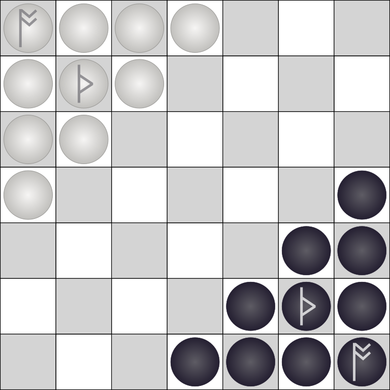

# Cyngesheall

> Version 0.2

## Overview

**Cyngesheall** is a free libre open source abstract strategy game where players try to capture the opposing king while trying to reach the opposite corner with their own king.

### Objective

Players maneuver their pieces to achieve one of two endgame states:

- Their king (*wóden-stán*) reaches the corner opposite the starting position.
- The opposing king is captured

### Components

- Game board (*tæfl*) with a 7x7 grid on it
- Approximately 16 unmarked stones (*stánas*) or tokens, split evenly between two colors
- 1 stone of each color marked in some manner (traditionally a *Þorn*, or "thorn" rune - ᚦ) to designate it as a *Þunor-stán* ("thunder-stone").
- 1 stone of each color marked in some manner (traditionally a *ós*, or "god" rune - ᚩ) to designate it as a *wóden-stán* ("Woden-stone").

### Example stones

  

  

### Setup

- Each player's king (*wóden-stán*) is placed in a corner opposite the other
- The "commander" (*Þunor-stán*) is placed one square diagonally from the king
- The remaining 8 stones of each color fill the corners to make a triangle

## Playing the game

Traditionally, the player using the darker colored stones plays first. Players then alternate taking turns.

### Moving

- Kings and regular stones may move any number of vacant spaces orthogonally, like rooks in chess or like pieces in hnefetafl
- Commanders may move any number of vacant spaces in any direction, including diagonally, similar to a chess queen
- No piece may pass over another piece in its path

### Capturing

- A player captures an enemy piece and removes it from the board by moving a piece so that the enemy piece becomes surrounded on two opposite sides (horizontally or vertically – not diagonally) by two friendly pieces. The king is also captured in this way.
- A piece may move between, or stop in-between, two enemy pieces without being captured.

### Winning the game

The player who captures the enemy king or guides their own king to the opposing corner is declared the winner.

## Credits

**Cyngesheall** was conceived by John Beers in 2024 as a quasi-historical boardgame similar to both **Oferhlýp** and **Mǽrstánas** and uses the same 7x7 grid. However, instead of "checkers with hit points" or making connections with stones, **Cyngesheall** take more direct inspiration from Hnefatafl. Aside from the setup, the primary differentiation is that the number of player pieces is even instead of asymmetrical, and each player has a king, which must reach the opposite corner rather than an edge.

> The word *cyngesheall* is an Anglo-Saxon (Old English) compound word meaning "king's hall". ([Source 1](https://bosworthtoller.com/7144), [Source 2](https://bosworthtoller.com/18427))

## Legal

**Cyngesheall** is available under a Creative Commons Attribution-ShareAlike 4.0 International license. (<https://creativecommons.org/licenses/by-sa/4.0/>)

**You are free to:**

- **Share** - copy and redistribute the material in any medium or format

- **Adapt** - remix, transform, and build upon the material for any purpose, even commercially.

The licensor cannot revoke these freedoms as long as you follow the license terms.

**Under the following terms:**

- Attribution - You must give appropriate credit, provide a link to the license, and indicate if changes were made. You may do so in any reasonable manner, but not in any way that suggests the licensor endorses you or your use.
- ShareAlike - If you remix, transform, or build upon the material, you must distribute your contributions under the same license as the original.

**No additional restrictions** — You may not apply legal terms or technological measures that legally restrict others from doing anything the license permits.

## Find out more

More information on **Cyngesheall** and “living rules” can be found at: <http://codeberg.org/jaerrib/cyngesheall>
